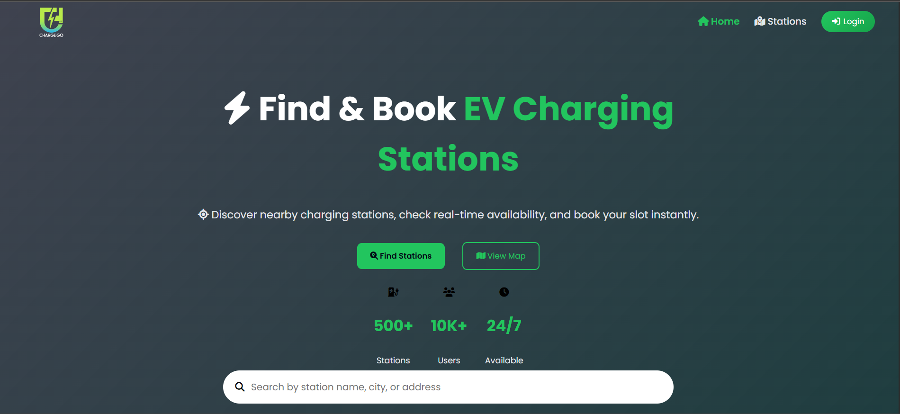
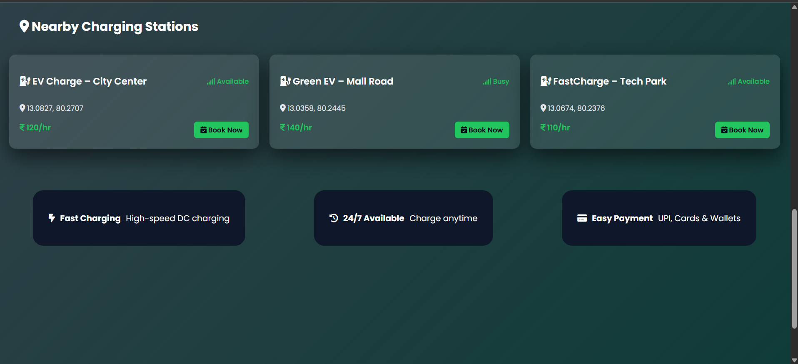
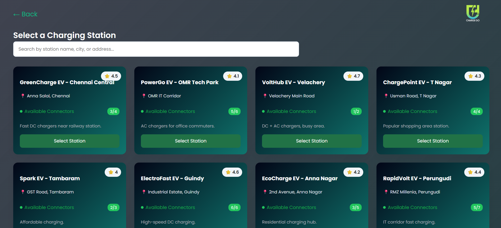
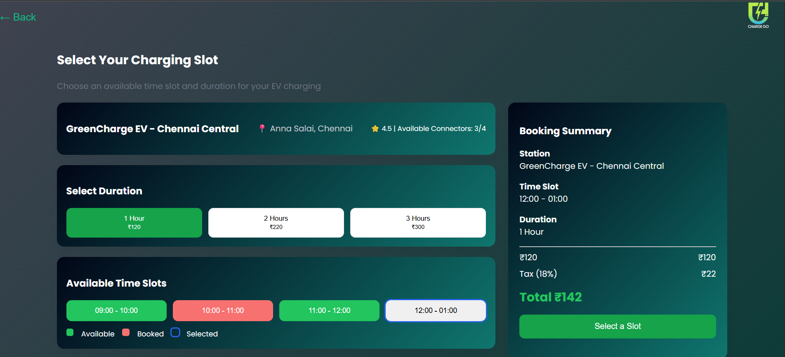
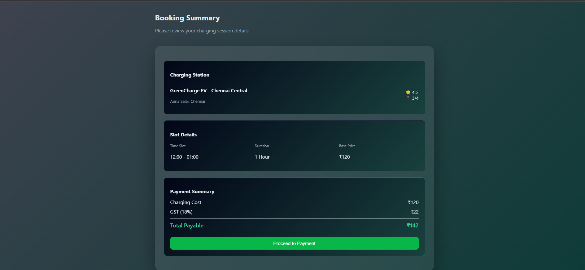
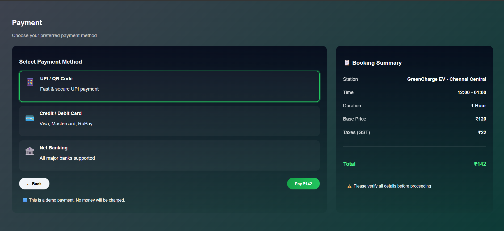
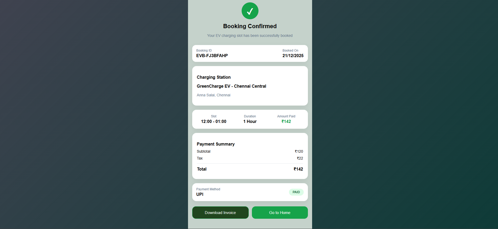
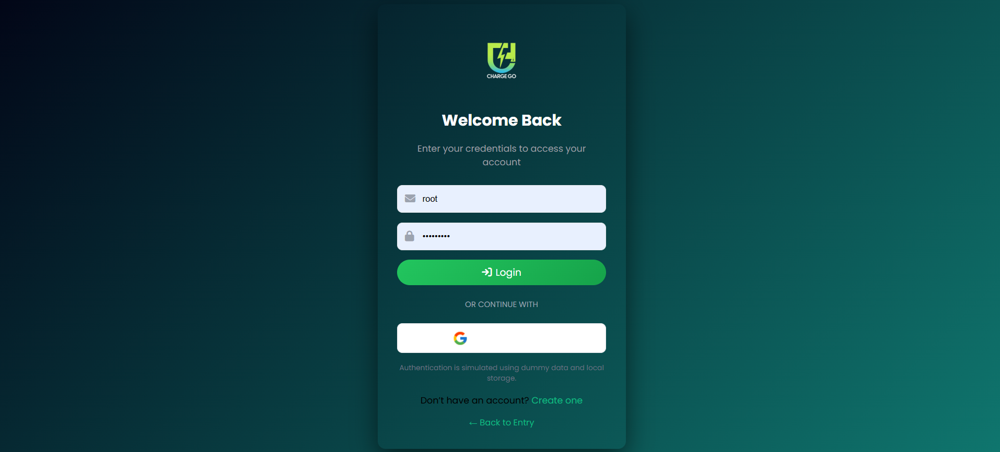
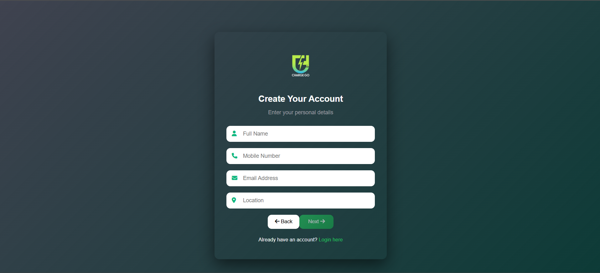
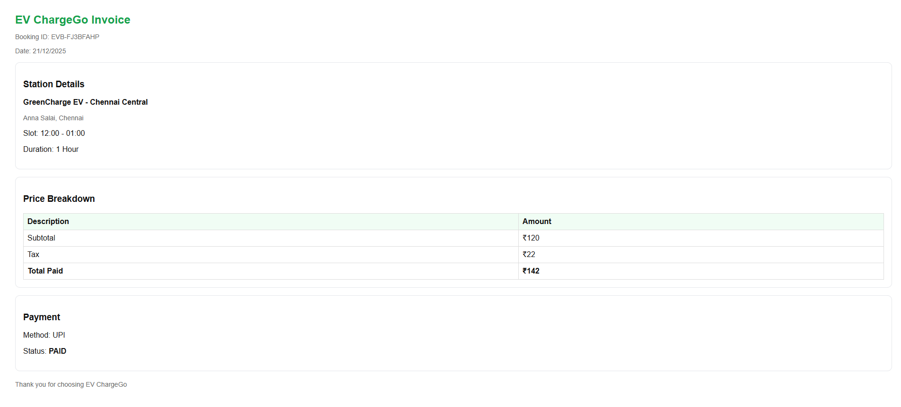

# ⚡ EV Charging Station Booking System (Angular)

A beginner-friendly frontend web application built using **Angular** that allows users to easily book EV charging slots.

## 🚀 Project Overview
This web app allows users to:
- View EV charging stations nearby
- Select a station and available charging slots
- Enter booking details
- Complete payment
- View booking confirmation

### Role & Responsibility
- Built the entire frontend using Angular
- Implemented routing between multiple pages
- Added slot selection and booking flow
- Designed responsive UI

## 🛠 Tech Stack
- Angular 16
- TypeScript
- HTML5 & CSS3

## 📸 Screenshots

### Home Page




### Select Station


### Slot Selection


### Booking Details


### Payment Page


### Booking Confirmation


### Login Page


### Create Account


### Downloaded Invoice


## ▶ How to Run
```bash
npm install
ng serve


👩‍💻 Developer: Sandhiyaa M
